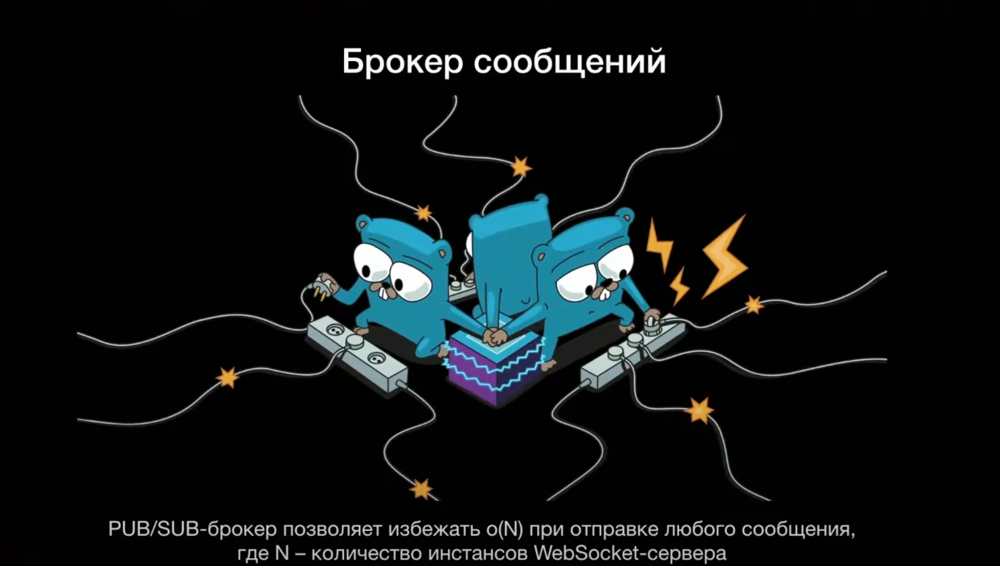

# nordkapp42


Напоминания по задачам для клона Trello

## Цели

- Каждодневная практика ответов на вопросы, которые спрашивают на собесах (анти пет-проект)
- Скрытая цель - "From Zero To Hero", подробности потом

## Требования

- Реализовать функционал в рамках секретного проекта
- Event Modeling > BDD > Integration/Unit Tests (via gherkingen / goconvey) > code for development via tests for external API of modules - `package module_test` / blackbox for refactoring > Unit Tests Coverage for internal functions in modules `package module` / whitebox for modifications (via ChatGPT)
- standard + [modules/layout](https://go.dev/doc/modules/layout) + evrone/go-clean-template + SOLID + Dependency Injection
- API на gRPC внутри, ванильный GraphQL наружу

## Применить инфраструктуру (вхождений на hh.ru)

- [ ] ~~RabbitMQ~~ (1417)
- [ ] Redis (1387)
- [ ] Kafka (2573)
- [ ] Grafana (1491)
- [ ] ~~Nagios~~ (65)
- [ ] ~~Zabbix~~ (1289)
- [ ] ~~ELK~~ (826)
- [ ] ~~FileBeat~~ (22)
- [ ] Prometheus (1138)
- [ ] ClickHouse (1149)
- [ ] Kubernetes (2446) или Minikube
- [ ] ~~MongoDB~~ (780)
- [ ] ~~MySQL~~ (1661)
- [ ] ~~Greenplum~~ (746)
- [ ] PostgreSQL (4585)
- [ ] ~~Airflow~~ (676)
- [ ] ~~Cadence~~ (69)
- [ ] Temporal (8)
- [ ] ~~Nginx~~ (2027)
- [ ] ~~Haproxy~~ (232)
- [ ] ~~Traefik~~ (24)
- [ ] ~~KrakenD~~ (5)
- [ ] Hasura (3), только как API-Gateway
- [ ] ~~GitLab~~ (2157) для CI/CD
- [ ] ~~Jenkins~~ (1276)
- [ ] ~~TeamCity~~ (345)
- [ ] ~~DeployHQ~~ (132)
- [ ] GitHub Actions (54): [Try & Makefile](https://github.com/nektos/act), [Marketplace](https://github.com/marketplace/), [Starter-Workflows](https://github.com/actions/starter-workflows), [QuickStart](https://docs.github.com/en/actions/quickstart).
- [ ] golangci-lint
- [ ] uber-go/automaxprocs
- [ ] uber-go/goleak - умеет показывать какие горутины не померли
- [ ] Reindexer https://habr.com/ru/articles/346884/
- [ ] Jitsu https://habr.com/ru/companies/jitsu/articles/523464/
- [ ] Centrifugo + [gobwas/ws](https://github.com/centrifugal/centrifuge/blob/master/_examples/ws_benchmarks/benchmark_gobwas/main.go)
- [ ] Livekit.io
- [ ] MINIO https://github.com/minio/minio-go
- [ ] Stitching or Federation - https://habr.com/ru/articles/728476/
- [ ] Автоматическая генерация миграций - https://github.com/ariga/atlas

## Для DevOPS

- [ ] ArgoCD + Helm - Наверное чтобы было понимание как вообще скейлится нагрузка в проде, чтобы не писал монолит которому нужно добавлять CPU только. ​Да не забей, научишься писать helm chart, и выучи что такое deployment/HPA и какие типы service есть. Напиши Helm chart для деплоя приложения в Kubernetes. Тебе нужно отдавать метрики в формате prometheus/тебе нужно иметь endpoint для health check/иметь логи в формате json.
- [ ] Kubernetes Operations - это Operator SDK for Platform Engineer.
- [ ] С помощью интеграции GitLab и Google Kubernetes Engine (GKE), вы можете установить GitLab Runners на GKE одним кликом и сразу начать запускать свои конвейеры CI2.

## Применить либы

- [ ] [mitchellh/mapstructure](https://github.com/mitchellh/mapstructure) - для мапинга данных GraphQL - [example 1](https://github.com/99designs/gqlgen/blob/master/_examples/todo/todo.go) - [example 2](https://gqlgen.com/reference/changesets/)
- [ ] gherkingen - для BDD
- [ ] testcontainers-go
- [ ] bufbuild/buf
- [ ] golang-migrate/migrate
- [ ] sqlize 
  - Generate sql migration from diff between existed sql and objects
  - Generate migration version - compatible with golang-migrate/migrate
- [ ] pressly/goose
- [ ] [механизм миграций из Hasura](https://hasura.io/docs/latest/migrations-metadata-seeds/manage-migrations/)
- [ ] flaggy | go-flags | pflag
- [ ] [Лучший regexp для Go](https://habr.com/ru/articles/756222/)
- [ ] цветные логи: https://github.com/GolangLessons/url-shortener/blob/c3987f66469a8d0769add18521adb9023520be95/internal/lib/logger/handlers/slogpretty/slogpretty.go
- [ ] codesenberg/bombardier, tsenart/vegeta, grafana/k6, wrk - для стресс-тестов
- [ ] allegro/bigcache - когда нужен просто кеш (рекомендации лучших собаководов из Avito)
- [ ] go-playground/validator - правильный валидатор
- [ ] ilyakaznacheev/cleanenv - yaml & env в одном флаконе + godotenv для чтения .env
- [ ] Netflix/go-env
- [ ] caarlos0/env
- [ ] spf13/viper
- [ ] jackc/pgx/v5/pgxpool / go-pg + pool - PG Pool
- [ ] jackc/pgx https://www.youtube.com/watch?v=sXMSWhcHCf8
  - [ ] https://github.com/jackc/pgxutil
  - [ ] https://github.com/wcamarao/pmx
- [ ] Masterminds/squirrel - SQL Builder (by Avito)
- [ ] er := errgroup.Group{}; eg.SetLimit(limit) - ещё один примитив синхронизации (golang.org/x/sync/errgroup)
- [ ] [Compile-time Dependency Injection for Go](https://github.com/google/wire)
- [ ] [Fx is a dependency injection system for Go](https://github.com/uber-go/fx)
- [ ] github.com/uber-go/zap or https://github.com/rs/zerolog
- [ ] github.com/golangci/golangci-lint
- [ ] github.com/uber-go/config
- [ ] [Методы организации DI и жизненного цикла приложения в GO](https://habr.com/ru/companies/vivid_money/articles/531822/)
- [ ] github.com/yonahd/kor@latest - инструмент для обнаружения неиспользуемых ресурсов Kubernetes
- [ ] gorilla/mux | stdlib mux 1.22 (or fiber or atreugo)
- [ ] bytedance/sonic
- [ ] failsafe-go.dev
- [ ] goconvey - is awesome BDD in Go
- [ ] github.com/uber-go/mock
- [ ] github.com/segmentio/kafka-go [Kafka, go и параллельные очереди](https://habr.com/ru/articles/769950/)
- [ ] https://github.com/grpc-ecosystem/grpc-gateway
- [ ] matoous/go-nanoid
- [ ] https://github.com/bufbuild/buf (вместо protoc для gRPC)
- [ ] https://github.com/mailhog/MailHog для тестирования почты
- [ ] https://github.com/IBM/sarama
- [ ] [настройки CORS](https://habr.com/ru/articles/598359/) [2](https://gqlgen.com/recipes/cors/) [3](https://gqlgen.com/recipes/authentication/)
- [ ] [Boilerplate for Go REST API with PostgreSQL database](https://github.com/comerc/go-api-boilerplate)
- [ ] [PostGraphile - Instant lightning-fast GraphQL API backed primarily by your PostgreSQL database.](https://github.com/graphile/crystal/tree/main/postgraphile/postgraphile)
- [ ] [dataloader на дженериках](https://github.com/vikstrous/dataloadgen) - [example](https://github.com/stasundr/gqlgen-pg-todo-example)
- [ ] [bun - SQL-first Golang ORM](https://github.com/uptrace/bun)
- [ ] https://github.com/cckwes/fiber-graphql-go
- [ ] https://github.com/stretchr/testify
- [ ] https://github.com/magefile/mage
- [ ] https://github.com/davecgh/go-spew/spew
- [ ] https://habr.com/ru/articles/672250/
- [ ] https://github.com/RobinCPel/graphql-postman
- [ ] https://github.com/oklog/ulid
- [ ] [wundergraph/cosmo](https://github.com/wundergraph/cosmo) The open-source solution to building, maintaining, and collaborating on GraphQL Federation at Scale. An alternative to Apollo Studio and GraphOS.
- [ ] [YugabyteDB is a high-performance, cloud-native, distributed SQL database that aims to support all PostgreSQL features](https://github.com/yugabyte/yugabyte-db)
- [ ] [Наш опыт проброса контекстов для cgo-вызовов на примере Reindexer](https://www.youtube.com/watch?v=r78oFeSp0pw)
- [ ] [10 GraphQL Developer Tools I Use To Make Building APIs Easier](https://wundergraph.com/blog/10_graphql_tools_to_increase_developer_productivity)
- [ ] https://connectrpc.com/
- [ ] Partial update (JSON Patch) - [Building realtime apps with Server-Sent Events and GraphQL](https://grafbase.com/blog/building-realtime-apps-with-server-sent-events-and-graphql)
- [ ] [A dream of scalable and enriched GraphQL subscriptions](https://medium.com/pipedrive-engineering/a-dream-of-scalable-and-enriched-graphql-subscriptions-724284448e65) 

## Реализация

[Event Modeling](https://draft.io/a77sr5g3fhhmq7dyykmu5pzhr7yzvdrrrt5nf3gmsmaw)

## How To Start

```bash
$ brew install golangci-lint
$ brew install mockery
$ brew install go-task
```

## How to build & run

```bash
$ docker-compose up -d --build
```

## Верхнеуровневый план

### Stage 1

- [x] Составить план - уже хороший план
- [x] LiveSharing
- [ ] Boilerplate (модульный монолит)
- Все сообщения хранятся вечно, и могут быть получены в отложенном режиме (Select Stream)
- [x] Простейшая реализация PUB/SUB 1-1 & 1-N
  - Members: и отправляют и читают
  - Rooms: 1-1 и 1-N (приватные и публичные)
- [x] Поднять Hasura 
  - [x] Определить соглашения в metadata 
  - [x] Сформировать migrations
- [x] JWT
- [x] GraphQL Subscribe via Websocket
- [ ] GraphQL Subscribe via SSE [server](https://github.com/99designs/gqlgen/pull/2498) & [client](https://the-guild.dev/graphql/sse)
- [ ] [gqlgen Set cookie from resolver](https://stackoverflow.com/questions/66090686/gqlgen-set-cookie-from-resolver)
- [ ] Проверить мультиплексирование подписок
- [ ] Список онлайн-пользователей

### Stage 2

- Поднять нагрузочное тестирование
- Поднять мониторинг (uptrace etc.)

### Stage 3

- Поднять Redis, а не RabbitMQ (для обработки всплесков нагрузки)

### Stage 4

- Поднять k8s

### Stage 5

- Микросервисы для "бутылочных горлышек" (а не для красоты)
- Поднять GRPS (для синхронных вызовов между микросервисами)
- Поднять Redis, а не RabbitMQ (для асинхронной шины данных между микросервисами)
- Поднять API Gateway https://loft.sh/blog/nginx-vs-traefik-vs-haproxy-comparing-kubernetes-ingress-controllers/
- Как поженить с Hasura под Highload

### Stage 6

- Чистую архитектуру, пожалуйста: ​или луковую, или гексагональную
- EventSourcing+CQRS
- Читаем с реплики, пишем в мастер

### Stage 7

- Temporal + https://github.com/vikstrous/tempts
- Поднять Kafka (для реализации "машины времени")

### Stage 8

- MINIO as S3 (для картинок)

### Stage 9

- Push-уведомления?

## gqlgen

- [Представляем gqlgen: генератор серверов GraphQL для Go](https://habr.com/ru/articles/792700/)
- [GraphQL и GO: простой способ бросить REST](https://www.youtube.com/watch?v=tv8muwgj-Y4)
- [gqlgen: GraphQL для строгих](https://www.youtube.com/watch?v=UP4w70VXKt4)
- https://github.com/comerc/graphql-articles
- https://github.com/nodkz/conf-talks
- https://altairgraphql.dev/
- [Лексоранги — что это такое и как их использовать для эффективной сортировки списков](https://habr.com/ru/articles/510448/)
- https://github.com/jaydenseric/graphql-multipart-request-spec
- https://github.com/vektah/dataloaden
- https://github.com/99designs/gqlgen
- [React Apollo, Gqlgen – авторизация. Часть 1](https://habr.com/ru/articles/598359/)
- [React Apollo, Gqlgen – авторизация. Часть 2](https://habr.com/ru/articles/599723/)
- [GraphQL и Golang](https://habr.com/ru/companies/ruvds/articles/444346/)
- [Разработка REST-серверов на Go. Часть 7: GraphQL](https://habr.com/ru/companies/ruvds/articles/568472/)
- [Как использовать GraphQL Federation для инкрементальной миграции с монолита (Python) на микросервисы (Go)](https://habr.com/ru/companies/macloud/articles/559352/)
- [Развитие инфраструктуры Погоды. Доклад Яндекса (как мы эволюционировали из REST в GraphQL и почему это сделало жизнь разработчиков фронтенда и приложений мягкой и шелковистой)](https://habr.com/ru/companies/yandex/articles/565234/)
- GQLGen PG TODO Example: [Variant1](https://github.com/comerc/gqlgen-pg-todo), [Variant2](https://github.com/stasundr/gqlgen-pg-todo-example)

---

- [GraphQL Multipart Request](https://www.apollographql.com/docs/router/executing-operations/subscription-multipart-protocol/)
- [Multipart HTTP protocol for GraphQL subscriptions](https://github.com/jaydenseric/graphql-multipart-request-spec)
- [GraphQL over WebSocket Protocol](https://github.com/apollographql/subscriptions-transport-ws/blob/master/PROTOCOL.md)
- [GraphQL Cursor Connections Specification](https://relay.dev/graphql/connections.htm)
- [Apollo Federation](https://www.apollographql.com/docs/apollo-server/federation/introduction)

---

Горизонтальное масштабирование кода на GoLang с использованием Kubernetes (k8s) можно реализовать следующим образом:

1. **Создание приложения**: Сначала создайте базовое веб-приложение на Go³.

2. **Контейнеризация приложения**: Примените Docker к вашему приложению Go, создав Dockerfile и собрав образ Docker³.

3. **Развертывание образа Docker в Kubernetes**: Создайте развертывание Kubernetes, которое использует ваш образ Docker³.

4. **Создание службы Kubernetes**: Создайте службу Kubernetes, которая обеспечивает доступ к вашему приложению³.

5. **Автомасштабирование**: Используйте Horizontal Pod Autoscaler (HPA) в Kubernetes для автоматического масштабирования вашего приложения в зависимости от нагрузки¹. HPA автоматически увеличивает или уменьшает количество подов в вашем развертывании в зависимости от текущей нагрузки¹.

6. **Оптимизация нагрузки на сервер**: Реализуйте лучшие практики для снижения нагрузки на сервер и достижения оптимального использования ресурсов². Это может включать в себя мониторинг с помощью готовности и живучести зондов, использование автомасштабирования и оптимизацию использования ресурсов².

7. **Тестирование**: Проведите тестирование, чтобы убедиться, что ваше приложение корректно масштабируется¹.

Помните, что горизонтальное масштабирование - это сложный процесс, который требует тщательного планирования и тестирования. Убедитесь, что вы полностью понимаете все аспекты вашего приложения, прежде чем начинать масштабирование¹.

Source: Conversation with Bing, 2/11/2024
(1) Build and Deploy Containerized Applications with Golang on Kubernetes. https://www.coding-bootcamps.com/build-containerized-applications-with-golang-on-kubernetes/.
(2) How to Configure Kubernetes Horizontal Pod Autoscaler using Metrics .... https://www.digitalocean.com/community/tutorials/how-to-configure-kubernetes-horizontal-pod-autoscaler-using-metrics-server.
(3) Optimizing Golang Applications for Kubernetes: Best Practices ... - Earthly. https://earthly.dev/blog/optimize-golang-for-kubernetes/.
(4) scale package - k8s.io/client-go/scale - Go Packages. https://pkg.go.dev/k8s.io/client-go/scale.
(5) Create a Kubernetes Operator in Golang to automatically manage a simple .... https://developers.redhat.com/blog/2020/12/16/create-a-kubernetes-operator-in-golang-to-automatically-manage-a-simple-stateful-application.

---

Выбор между Kafka, NATS и RabbitMQ для обработки всплесков нагрузки также зависит от ваших конкретных потребностей и предпочтений. Вот некоторые ключевые особенности каждого из них:

**Kafka**:

- Kafka обеспечивает высокую пропускную способность для обработки входящих и исходящих потоков данных в реальном времени¹.
- Kafka обеспечивает устойчивость к сбоям благодаря репликации данных между узлами¹.
- Kafka поддерживает "по крайней мере один раз" и "ровно один раз" доставку сообщений¹.
- Kafka не поддерживает многопользовательский режим¹.

**NATS**:

- NATS известен своей высокой масштабируемостью и низкой задержкой. Он спроектирован для эффективной обработки большого количества подписчиков и сообщений¹.
- NATS поддерживает "по крайней мере один раз", и "ровно один раз" доставку сообщений в JetStream¹.
- NATS поддерживает истинный многопользовательский режим и децентрализованную безопасность через учетные записи и определение общих потоков и услуг¹.

**RabbitMQ**:

- RabbitMQ обеспечивает "по крайней мере один раз" и "ровно один раз" доставку сообщений¹.
- Масштабируемость RabbitMQ ограничена его дизайном. Он полагается на централизованный брокер, который может стать узким местом при обработке большого объема сообщений².
- RabbitMQ поддерживает многопользовательский режим с помощью виртуальных хостов; обмен данными не поддерживается¹.

Все три инструмента являются мощными и могут быть использованы для обработки всплесков нагрузки, но выбор между ними будет зависеть от ваших конкретных требований и предпочтений. Вы можете найти дополнительную информацию о сравнении Kafka, NATS и RabbitMQ в [этой статье](^1^) и [этой статье](^2^).

Source: Conversation with Bing, 2/11/2024
(1) Compare NATS - NATS Docs. https://docs.nats.io/compare-nats.
(2) RabbitMQ против Kafka: два разных подхода к обмену сообщениями. https://habr.com/ru/companies/itsumma/articles/416629/.
(3) Compare NATS - NATS Docs. https://docs.nats.io/compare-nats.
(4) RabbitMQ против Kafka: два разных подхода к обмену сообщениями. https://habr.com/ru/companies/itsumma/articles/416629/.
(5) Apache Kafka и RabbitMQ: в чем разница и что лучше изучать?. https://habr.com/ru/companies/slurm/articles/666326/.

---

Tarantool может быть использован в качестве горячего кэша перед PostgreSQL. Вот некоторые основные преимущества этого подхода:

1. **Высокая производительность**: Tarantool известен своей высокой производительностью и способностью обрабатывать большое количество запросов в секунду¹.

2. **Гибкость**: Tarantool позволяет вам хранить данные в памяти и на диске, что дает вам гибкость в управлении вашими данными¹.

3. **Простота использования**: Tarantool имеет простой и интуитивно понятный API, который делает его легким в использовании¹.

4. **Совместимость с PostgreSQL**: Существует коннектор Tarantool для PostgreSQL, который позволяет вам легко интегрировать эти две системы³.

Однако, стоит отметить, что использование Tarantool в качестве кэша перед PostgreSQL может потребовать дополнительной настройки и адаптации вашего приложения. Вам нужно будет настроить ваше приложение так, чтобы оно сначала проверяло данные в Tarantool, а затем, если данные не найдены, обращалось к PostgreSQL¹.

Вы можете найти дополнительную информацию о использовании Tarantool в качестве кэша в [этой статье](^1^) и [этой статье](^2^).

Source: Conversation with Bing, 2/11/2024
(1) Как использовать tarantool в качестве кэша существующей базы?. https://ru.stackoverflow.com/questions/700552/%d0%9a%d0%b0%d0%ba-%d0%b8%d1%81%d0%bf%d0%be%d0%bb%d1%8c%d0%b7%d0%be%d0%b2%d0%b0%d1%82%d1%8c-tarantool-%d0%b2-%d0%ba%d0%b0%d1%87%d0%b5%d1%81%d1%82%d0%b2%d0%b5-%d0%ba%d1%8d%d1%88%d0%b0-%d1%81%d1%83%d1%89%d0%b5%d1%81%d1%82%d0%b2%d1%83%d1%8e%d1%89%d0%b5%d0%b9-%d0%b1%d0%b0%d0%b7%d1%8b.
(2) GitHub - tarantool/pg: PostgreSQL connector for Tarantool. https://github.com/tarantool/pg.
(3) Как использовать tarantool в качестве кэша существующей базы?. https://ru.stackoverflow.com/questions/700552/%d0%9a%d0%b0%d0%ba-%d0%b8%d1%81%d0%bf%d0%be%d0%bb%d1%8c%d0%b7%d0%be%d0%b2%d0%b0%d1%82%d1%8c-tarantool-%d0%b2-%d0%ba%d0%b0%d1%87%d0%b5%d1%81%d1%82%d0%b2%d0%b5-%d0%ba%d1%8d%d1%88%d0%b0-%d1%81%d1%83%d1%89%d0%b5%d1%81%d1%82%d0%b2%d1%83%d1%8e%d1%89%d0%b5%d0%b9-%d0%b1%d0%b0%d0%b7%d1%8b.
(4) postgresql - Using Tarantool and Postgres together - Stack Overflow. https://stackoverflow.com/questions/55460604/using-tarantool-and-postgres-together.
(5) undefined. https://www.computerweekly.com/feature/Write-through-write-around-write-back-Cache-explained.
(6) undefined. https://github.com/bucardo/bucardo.
(7) undefined. https://www.tarantool.io/en/doc/2.2/reference/reference_rock/dbms/.

## Что нужно от брокера?



- Производительность
- Сохранение порядка сообщений - [ULID](https://danyloff.tech/2023/10/01/ulid-%D1%82%D0%BE%D1%82-%D1%81%D0%B0%D0%BC%D1%8B%D0%B8-%D1%84%D0%BE%D1%80%D0%BC%D0%B0%D1%82-%D0%B8%D0%B4%D0%B5%D0%BD%D1%82%D0%B8%D1%84%D0%B8%D0%BA%D0%B0%D1%82%D0%BE%D1%80%D0%B0-%D0%BA%D0%BE%D1%82/)
- Масштабируемость брокера
- Миллионы топиков
- Кэш/стрим сообщений
- Возможность писать процедуры - большой бонус

[Масштабируем WebSocket-соединения на Go / Александр Емелин (Авито)](https://www.youtube.com/watch?v=eP_02zkwM5Y)

> на 100000 соединений RabbitMQ потреблял 70 CPU, а Redis - 0,3 CPU

- Sentinel является менеджером отказоустойчивости репликации для Redis.

- github.com/gogo/protobuf - ускоряет сериализацию protobuf в пять раз, т.к. вметсо reflect использует кодогенерацию (ffjson & easyjson - такая же история).

***

Go-Fiber

https://github.com/99designs/gqlgen/discussions/1802
https://github.com/99designs/gqlgen/issues/1281
https://github.com/99designs/gqlgen/issues/1664#issuecomment-1616620967

***

Нагрузочное тестирование Centrifugo

https://github.com/centrifugal/centrifugo/blob/master/misc/benchmarking/k6/readme.md
https://github.com/centrifugal/centrifuge/tree/master/_examples/ws_benchmarks/benchmark_gobwas
https://github.com/centrifugal/centrifuge/tree/master/_examples/ws_benchmarks/benchmark_gorilla

***

## Setup Hasura

```bash
$ cd hasura && docker-compose up -d
```

#### Connect Database

- Database Display Name: default
- Environment Variable: PG_DATABASE_URL

## How to save DB-Schema

```bash
$ cd hasura
$ rm -rf migrations
$ hasura migrate create "init" --from-server --database-name default
$ rm -rf metadata
$ hasura metadata export
```

## How to restore DB-Schema

```bash
$ cd hasura
$ hasura migrate apply
$ hasura metadata apply
```

## How to backup data

```bash
$ cd hasura
$ curl --location --request POST 'http://localhost:8080/v1alpha1/pg_dump' --header 'x-hasura-admin-secret: myadminsecretkey' --header 'Content-Type: application/json' --data-raw '{ "opts": ["-O", "-x", "--data-only", "--schema", "public", "--schema", "auth"], "clean_output": true}' -o data.sql
```

## How to restore data

```bash
$ cd hasura
$ cat data.sql | docker exec -i nordkapp42-postgres-1 psql -U postgres
```

## How To Start

```bash
$ npm install
$ npm run dev
```

## Install the Hasura CLI, and dive into the console

```bash
hasura init
cd hasura && hasura console
```

## How To Generate GraphQL Schema

via Apollo CLI (deprecated)

```bash
$ npm install -g apollo graphql
$ apollo client:download-schema --endpoint http://localhost:8080/v1/graphql --header "X-Hasura-Admin-Secret: myadminsecretkey"
```

via Apollo Rover

```bash
$ npm install -g @apollo/rover
$ rover graph introspect --header "X-Hasura-Admin-Secret: myadminsecretkey" http://localhost:8080/v1/graphql > schema.graphql
```

***

## Соглашения 

- Таблицы именуются во множественном числе.
- Переименования в metadata для соответствия GraphQL-типов. 
- Таблицы и колонки именуются через подчёркивание (в Python-стиле).
- Data Manager > Edit > GraphQL Customization > Naming Conversion > graphql-default
- Поля id, created_by, updated_by в начале каждой таблицы сущности.
- Enum-таблицы имеют одно поле с именем value, именуются в единственном числе.
- Поле id инкрементится через identity.
- Не следует использовать (bun.DB).NewRaw() - для него не работает логирование.

## Схема БД

- members
  - id
  - name

- rooms
  - id
  - name
  - kind
  * messages

- messages
  - id
  - room_id
  - member_id
  - text
  - is_read
  * member

- room_members
  - member_id
  - room_id

## How to get JWT

https://jwt.io/

```yml
HASURA_GRAPHQL_JWT_SECRET: '{ "type": "HS256", "key": "30b50d8699c8b71ea291f453877e5dec" }'
```

```json
{
  "sub": "1234567890",
  "name": "John Doe",
  "admin": true,
  "iat": 1516239022,
  "https://hasura.io/jwt/claims": {
    "x-hasura-allowed-roles": ["editor","user", "mod"],
    "x-hasura-default-role": "user",
    "x-hasura-user-id": "1",
    "x-hasura-org-id": "123",
    "x-hasura-custom": "custom-value"
  }
}
```

Authorization Bearer <JWT>

***

Какие есть инструменты для организации нагрузочного тестирования GraphQL Subscriptions?

- https://habr.com/ru/companies/lineate/articles/598149/
- https://dev.to/augustocalaca/how-to-test-graphql-subscriptions-4mld
- https://github.com/grafana/k6/blob/master/examples/graphql.js
- https://medium.com/@javierfernandes/testing-graphql-subscriptions-ee14d63bf97a
- https://github.com/hasura/graphql-bench
- https://github.com/hasura/graphql-subscriptions-benchmark
- https://www.yugabyte.com/blog/building-resilient-graphql-apps-and-scaling-them-to-1m-subscriptions/
- https://developer.ibm.com/articles/awb-load-testing-graphql-performance-with-k6-and-stepzen/
- https://wundergraph.com/blog/edfs_scaling_graphql_subscriptions_in_go
- https://hasura.io/blog/graphql-performance-benchmarks-hasura-vs-diy-nodejs-dataloader
- https://zendesk.engineering/mock-graphql-operations-with-laika-the-only-apollo-client-mocking-tool-youll-need-c116e1f62128
- https://the-guild.dev/graphql/envelop/docs/guides/monitoring-and-tracing
- https://k6.io/blog/load-testing-graphql-with-k6/
- https://wundergraph.com/blog/quirks_of_graphql_subscriptions_sse_websockets_hasura_apollo_federation_supergraph
- https://medium.com/swlh/performance-testing-a-graphql-server-with-apache-jmeter-tutorial-for-beginners-da5f7cf8b810
- https://github.com/YugabyteDB-Samples/yugabyte-graphql-apps/tree/master/graphql-subscription-with-yugabytedb/graphql-subscription-perf-tool
- https://github.com/eranyanay/1m-go-websockets


## Why EntGo?

...

Как вы видите, вы должны принимать решения очень рано при проектировании вашей схемы GraphQL, а также схемы базы данных, чтобы иметь возможность надлежащим образом защищать узлы. Каждый раз, когда вы входите в узел, вы должны быть в состоянии ответить на вопрос, разрешено ли текущему зарегистрированному пользователю видеть поле или нет.

Таким образом, возникает вопрос, должна ли эта логика действительно находиться в резолвере. Если вы спросите создателей GraphQL, их ответ будет "нет". Поскольку они уже решили проблему на слое ниже резолверов, слое доступа к данным или их "Entity (Ent) Framework", они не затрагивали проблему с GraphQL. Это также причина, почему авторизация полностью отсутствует в GraphQL.

Сказав это, решение проблемы на слое ниже не является единственным допустимым решением. Если это сделано правильно, вполне нормально решать проблему из резолверов.

Прежде чем мы продолжим, вы должны взглянуть на отличный фреймворк entgo и его архитектуру. Даже если вы не собираетесь использовать Golang для построения слоя вашего API, вы можете увидеть, сколько мысли и опыта вложено в дизайн фреймворка. Вместо того чтобы разбрасывать логику авторизации по вашим резолверам, вы можете определить политики на уровне данных, и нет никакого способа обойти их. Политика доступа является частью модели данных. Вам не обязательно использовать фреймворк, как entgo, но имейте в виду, что тогда вам придется решить эту сложную проблему самостоятельно.

***

Клавиатурная болезнь:

- База 61
- Кепки 28
- Свичи 56
- Артизан 16
- Смазка 6
- Кофр 9
- Нумпад 1 46
- Нумпад 2 47
- Прокладки 5
- Пинцет 1
- Съёмник 2
- Магнитные разъемы 2
Итого: 279

***

> Interested to understand how does this compares and relates to https://github.com/99designs/gqlgen. Especially in the area of type system, is this reflection based, materialized types?
	
jensneuse on March 2, 2022:

gqlgen allows you to write GraphQL Servers with resolvers, etc. graphql-go-tools implements not just the GraphQL specification but also comes with a GraphQL engine that is "thunk-based". What this means is that you don't "implement" resolvers, you configure them. We then have a Query Planner, similar to a SQL database, that can make a stateless execution plan for a given GraphQL query. This plan can be cached and then executed, making it very efficient.

What's possible so far is that you can combine multiple GraphQL and REST APIs into a single unified GraphQL API. It also supports Apollo Federation as upstream, including subscriptions.

The whole system is very flexible and extensible so that you can implement a few interfaces and add support for e.g. gRPC or Kafka as upstream.

We're using the engine in WunderGraph to make it easy to configure and use: https://wundergraph.com/ What WunderGraph does is it gives you a TypeScript SDK to automatically configure the "unified graph" based on introspecting one or more DataSources, e.g. OpenAPI (REST), GraphQL, Federation and Databases like PostgreSQL, MySQL, Planetscale etc..

What problem does it solve? Using this engine, you can talk to multiple heterogenous systems as if they are one single GraphQL API, even though their sub protocols are different.

***

как организовать подписки GraphQL через директивы @defer & @stream & @live

https://the-guild.dev/graphql/yoga-server/docs/features/defer-stream
https://www.apollographql.com/blog/new-features-in-graphql-batch-defer-stream-live-and-subscribe

***

## Experimental GraphQL Playground

https://codesandbox.io/p/sandbox/graphql-live-query-nuq4v

Features:
- Query (HTTP, HTTP-Multipart, WebSocket)
- Mutation (HTTP, HTTP-Multipart, WebSocket)
- Query with @defer (HTTP-Multipart, WebSocket)
- Query with @stream (HTTP-Multipart, WebSocket)
- Subscription (WebSocket/SSE)
- Query with @live (WebSocket/SSE)

Check out the Fetcher implementations on GraphiQL

Built on the following transports:

- graphql-helix - GraphQL over HTTP
- graphql-ws - GraphQL over WebSocket
- @n1ru4l/socket-io-graphql-server - GraphQL over Socket.io

and powered by the following libraries:

- graphql-js - The JavaScript reference implementation for GraphQL
- meros - Makes reading multipart responses simple
- SSE-Z - Simple SSE wrapper
- graphql-live-query - GraphQL live queries for any GraphQL schema

***

## GraphQL Subscribe via SSE

```bash
brew install mkcert
mkcert -install
mv localhost-key.pem localhost.pem dest-dir
mkcert localhost
```

```bash
curl -N --request POST --url https://localhost:8888/api \
--data '{"query":"subscription { currentTime { unixTime timeStamp } }"}' \
-H "accept: text/event-stream" -H 'content-type: application/json' \
--verbose
```

***

